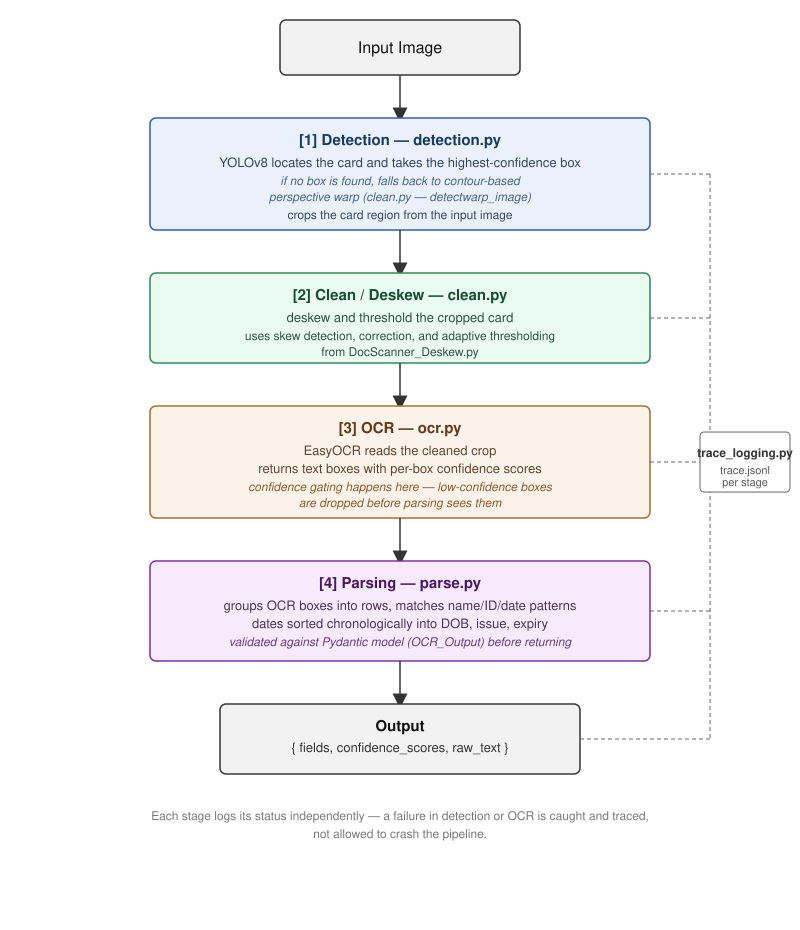

# ID Field Extractor

A pipeline that takes a photo of an ID-style card and returns structured fields — name, ID number, date of birth, date of issue, expiry date — as validated JSON, with confidence scores and a full trace log.

## Pipeline Overview



Each stage is isolated so a failure in one (e.g. no card detected, OCR returns nothing) doesn't crash the run — it's logged and passed downstream as a flagged/empty result.

## How It Works

**Detection (`detection.py`)** — A YOLOv8 model (`yolov8n.pt`) is run on the input image and the highest-confidence box is taken as the card region. If YOLO finds nothing, `detectwarp_image()` in `clean.py` is used as a backup: it contour-detects the card edges and applies a perspective warp to extract it. YOLO is the primary path; the contour-based warp only runs when YOLO fails to find a box.

**Clean / Deskew (`clean.py`, `DocScanner_Deskew.py`)** — The cropped card is deskewed and thresholded via `clean_image()`, which detects the skew angle, corrects it, and applies adaptive thresholding. `DocScanner_Deskew.py` carries over the contour detection, perspective transform, and skew-correction logic from an earlier standalone project — [Document-Scanner-Deskew-Tool](https://github.com/SuneetAroraa/Document-Scanner-Deskew-Tool) — reused here for both the detection fallback and the cleaning step.

**OCR (`ocr.py`)** — EasyOCR reads the cleaned crop and returns text boxes with confidence scores. Per-box confidence is where gating happens: boxes are logged with an average confidence and a count of how many fell below the threshold, and low-confidence boxes are dropped before parsing ever sees them.

**Parsing (`parse.py`)** — Raw OCR boxes are grouped into rows by vertical position, then matched against patterns for dates, ID numbers, and names. Multiple dates on a card are sorted chronologically and assigned to date of birth, date of issue, and expiry date. The result is validated against a Pydantic model (`OCR_Output`) before being returned, so the output shape is always guaranteed.

**Trace logging (`trace_logging.py`)** — Every stage writes one line to `trace.jsonl`: detection method and confidence, OCR block counts and average confidence, and which fields parsing found.

## Output Format

```json
{
  "fields": {
    "name": "JOHN DOE",
    "id_number": "A1234567",
    "date_of_birth": "12-04-1998",
    "date_of_issue": "05-06-2023",
    "expiry_date": "12-04-2028"
  },
  "confidence_scores": {
    "name": 0.93,
    "id_number": 0.88,
    "date_of_birth": 0.61
  },
  "raw_text": "..."
}
```

Fields with no confident match are left as `null` rather than guessed.

## Trace Log Format

```
{"timestamp": "...", "stage": "detection", "method": "yolo", "box_found": true, "confidence": 0.91, "box": [...]}
{"timestamp": "...", "stage": "ocr", "num_text_blocks": 14, "filtered_below_threshold": 2, "confidence_avg": 0.74}
{"timestamp": "...", "stage": "parse", "fields_found": ["name", "id_number", "date_of_birth"], "confidence_scores": {...}}
```

One line per stage, appended to `trace.jsonl` for each run.

## Project Structure

```
ID-Field-Extractor/
├── detection.py           # YOLO detection + contour-based warp fallback
├── clean.py                # deskew/clean pipeline, warp fallback helper
├── DocScanner_Deskew.py    # contour approximation, perspective transform, skew correction
├── ocr.py                   # EasyOCR text extraction, confidence gating
├── parse.py                 # row grouping, field extraction, Pydantic validation
├── trace_logging.py          # .jsonl trace logger
├── main.py                   # CLI entry point
├── app.py                     # FastAPI endpoint (/extract-id)
├── trace.jsonl                # sample trace log from a test run
└── docs/
    └── pipeline_overview.svg
```

## Running It

CLI:
```
python main.py
```

API:
```
uvicorn app:app --reload
```
`POST /extract-id` with an image file returns `{fields, confidence_scores, raw_text}`.

## Requirements

- Python 3.11
- OpenCV
- EasyOCR
- Ultralytics (YOLOv8)
- Pydantic
- FastAPI (for the API endpoint)

## Related Projects

- [Document-Scanner-Deskew-Tool](https://github.com/SuneetAroraa/Document-Scanner-Deskew-Tool) — standalone contour detection, perspective transform, and deskew pipeline that `DocScanner_Deskew.py` in this repo is built on.

## Status

Tested end-to-end on sample ID cards. Detection and OCR stages handle missing or degenerate input without crashing the main pipeline; low-confidence fields are flagged instead of guessed.
